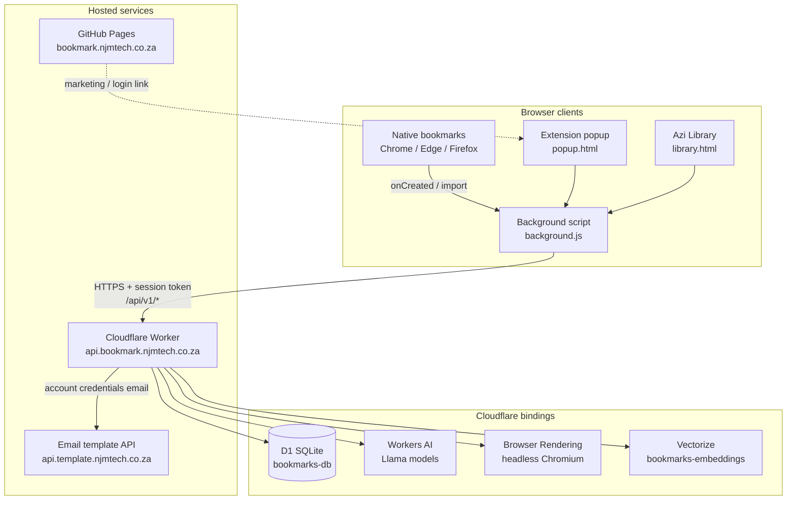
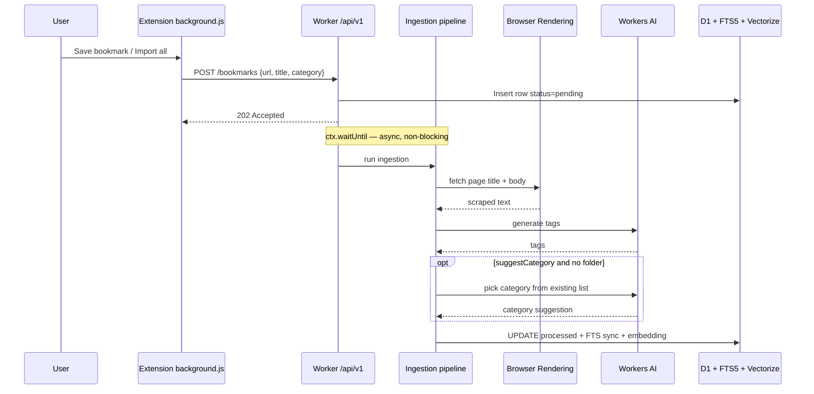
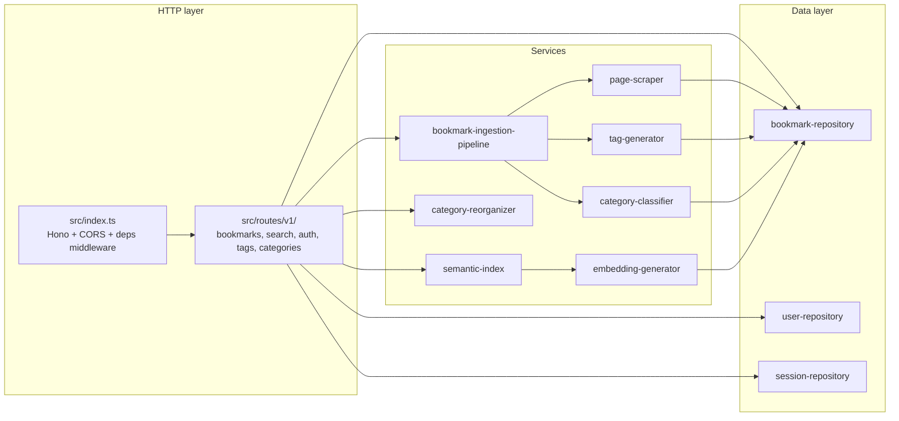
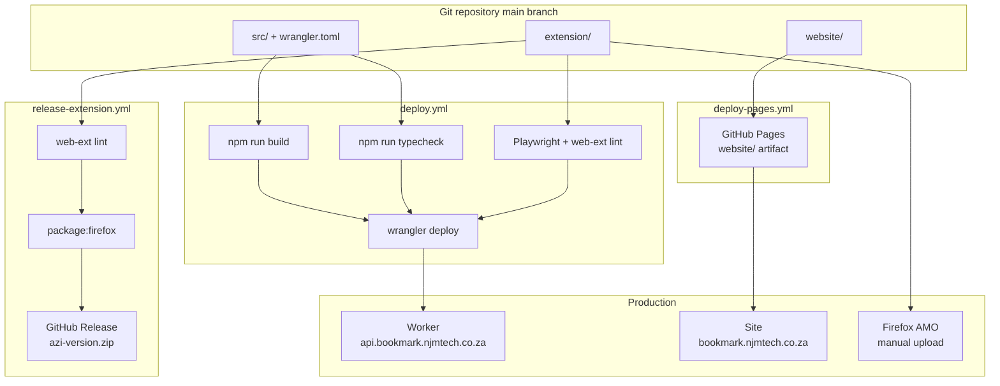

# Azi — project setup

This document describes how **Azi** (`bookmark-sync-engine`) is put together: the browser extension, Cloudflare Worker backend, supporting services, and how changes reach production.

## System overview



| Component | Location | Role |
|---|---|---|
| **Extension** | `extension/` | MV3 add-on for Chrome, Edge, and Firefox. Syncs bookmarks, provides popup, Library UI, and omnibox search. |
| **Worker API** | `src/` → `wrangler deploy` | Hono app at `/api/v1`. Auth, bookmark CRUD, search, AI tagging/categorization. |
| **Marketing site** | `website/` | Static landing page on GitHub Pages. |
| **Config** | `extension/config.js` (gitignored) | Points extension at `WORKER_API_URL`. Session token stored in `browser.storage.local` after login. |

## Bookmark ingestion flow

When a bookmark is created or imported, the extension POSTs immediately and the Worker finishes processing in the background.



## Worker internals

The Worker is layered behind interfaces; `src/container.ts` wires concrete Cloudflare bindings to route handlers.



## Deployment and CI

Two GitHub Actions workflows publish different parts of the project.



### Secrets and config

| Where | What |
|---|---|
| **Cloudflare** | `API_TOKEN` via `wrangler secret put`; D1, AI, Browser Rendering, Vectorize bindings in `wrangler.toml` |
| **GitHub Actions** | `CLOUDFLARE_API_TOKEN`, `CLOUDFLARE_ACCOUNT_ID` for Worker deploy |
| **Extension (local / zip)** | Copy `extension/config.example.js` → `extension/config.js`; login via popup Account tab |

### Packaging for Firefox

Build an AMO upload zip locally from the repo root:

```sh
npm run package:firefox
```

Output: `web-ext-artifacts/azi-<version>.zip` (version from `extension/manifest.json`).

### GitHub Releases

The [`release-extension.yml`](../.github/workflows/release-extension.yml) workflow publishes the same zip to **GitHub Releases** when you push a version tag:

```sh
# 1. Bump "version" in extension/manifest.json first
git tag v1.0.2
git push origin v1.0.2
```

The tag (`v1.0.2`) must match the manifest version (`1.0.2`). You can also run the workflow manually from the Actions tab; it uses the manifest version and creates the tag if needed.

## Local development

```sh
npm install
npm run dev          # wrangler dev — local Worker
npm run db:init      # apply schema.sql to local D1
npm run typecheck
npm run test:extension
npm run lint:firefox
```

Load the extension unpacked from `extension/` in `chrome://extensions` or Firefox `about:debugging`.
