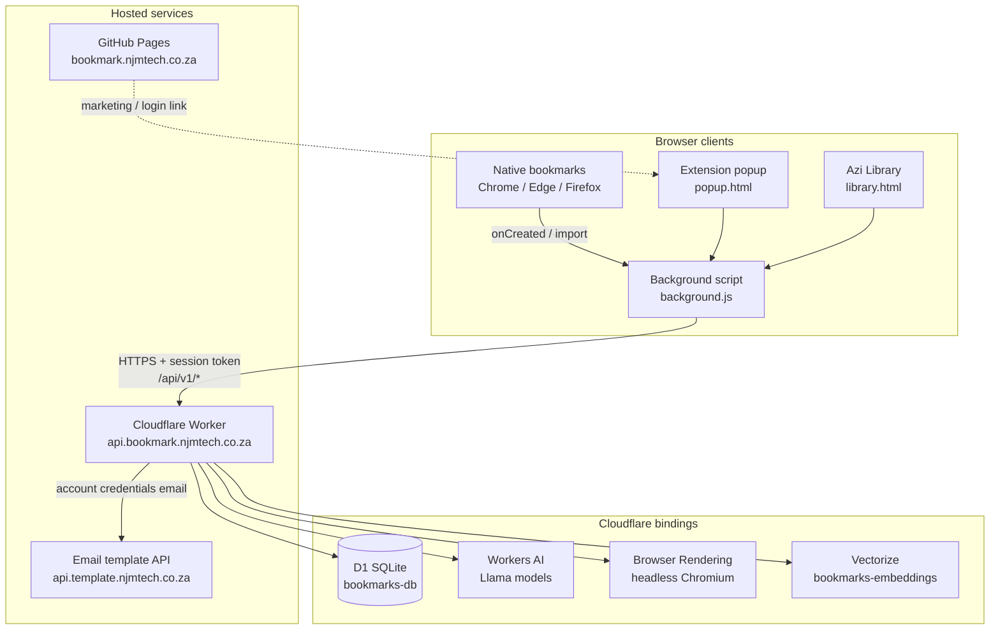
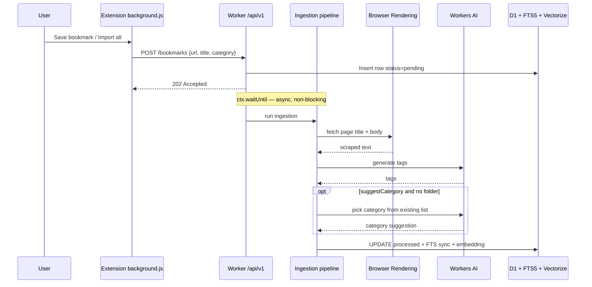
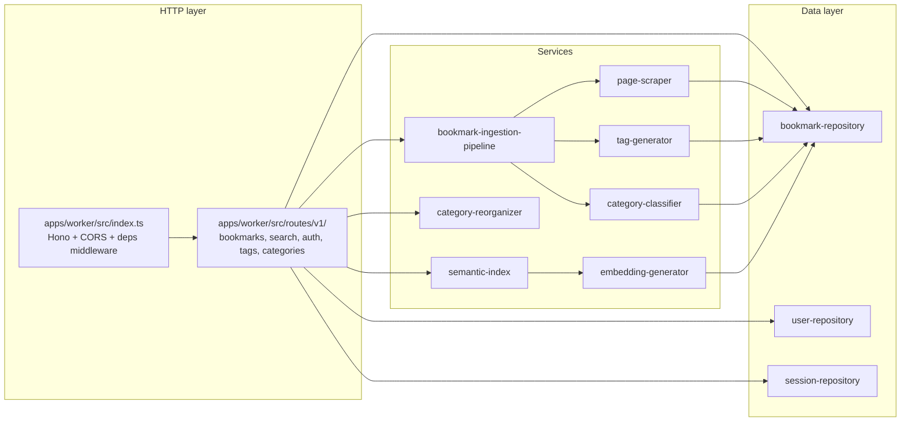
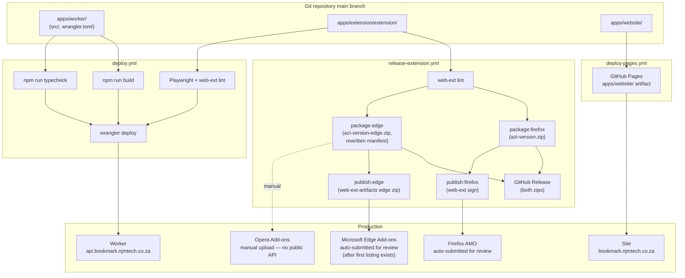

# Azi — project setup

This document describes how **Azi** (`bookmark-sync-engine`) is put together: the browser extension, Cloudflare Worker backend, supporting services, and how changes reach production.

## System overview



| Component | Location | Role |
|---|---|---|
| **Extension** | `apps/extension/extension/` | MV3 add-on for Chrome, Edge, and Firefox. Syncs bookmarks, provides popup, Library UI, and omnibox search. |
| **Worker API** | `apps/worker/src/` → `wrangler deploy` | Hono app at `/api/v1`. Auth, bookmark CRUD, search, AI tagging/categorization. |
| **Marketing site** | `apps/website/` | Static landing page on GitHub Pages. |
| **Config** | `apps/extension/extension/config.js` (gitignored) | Points extension at `WORKER_API_URL`. Session token stored in `browser.storage.local` after login. |

## Bookmark ingestion flow

When a bookmark is created or imported, the extension POSTs immediately and the Worker finishes processing in the background.



## Worker internals

The Worker is layered behind interfaces; `apps/worker/src/container.ts` wires concrete Cloudflare bindings to route handlers.



## Deployment and CI

Two GitHub Actions workflows publish different parts of the project.



### Secrets and config

| Where | What |
|---|---|
| **Cloudflare** | `API_TOKEN` via `wrangler secret put`; D1, AI, Browser Rendering, Vectorize bindings in `apps/worker/wrangler.toml` |
| **GitHub Actions (Worker)** | `CLOUDFLARE_API_TOKEN`, `CLOUDFLARE_ACCOUNT_ID` for Worker deploy (workflow sets `workingDirectory: apps/worker` on the wrangler-action step) |
| **GitHub Actions (Firefox)** | `AMO_JWT_ISSUER`, `AMO_JWT_SECRET` — API key/secret from [addons.mozilla.org/developers/addon/api/key](https://addons.mozilla.org/developers/addon/api/key/) |
| **GitHub Actions (Edge)** | `EDGE_CLIENT_ID`, `EDGE_API_KEY` from Partner Center → Microsoft Edge → **Publish API** → Create API credentials; `EDGE_PRODUCT_ID` from the extension's page in Partner Center |
| **Extension (local / zip)** | Copy `apps/extension/extension/config.example.js` → `apps/extension/extension/config.js`; login via popup Account tab |

Any of the store secrets missing just skips that store's submission step — the GitHub Release step always runs regardless.

### Packaging: two different zips, not one

There are **two** build flavors, and they are not interchangeable — Chromium's package validator (used by both Edge Add-ons and, since Opera is also Chromium-based, almost certainly Opera Add-ons too) rejects two things the Firefox-oriented manifest has:

- `background.scripts` present alongside `background.service_worker` under `manifest_version: 3` (Firefox needs `scripts`; Chrome/Edge only ever read `service_worker` and `background.js` picks its own bootstrap path via `typeof importScripts`, so `scripts` is dead weight there)
- a `description` over 132 characters (Firefox/AMO has no such limit)

```sh
npm run package:firefox   # web-ext-artifacts/azi-<version>.zip        — Firefox/AMO
npm run package:edge      # web-ext-artifacts/azi-<version>-edge.zip   — Edge, Opera, Chrome
```

`package:edge` runs `apps/extension/scripts/build-edge-package.js` first, which copies `apps/extension/extension/` into a gitignored `apps/extension/.edge-build/`, strips `background.scripts` and `browser_specific_settings`, and swaps in a ≤132-character description — then packages *that*. **Use the `-edge.zip` build for Opera's manual upload too**, not the plain one — the plain Firefox zip will fail Opera's validator with the same errors Edge gives.

Both packaging scripts always overwrite `apps/extension/extension/config.js` from `apps/extension/extension/config.example.js` before building, regardless of whatever `config.js` already exists locally — a distributable package must never be able to ship a developer's local override or stale secret.

### GitHub Releases, and auto-submission to Firefox/Edge

The [`release-extension.yml`](../.github/workflows/release-extension.yml) workflow lints, packages, and publishes the zip to **GitHub Releases** when you push a version tag:

```sh
# 1. Bump "version" in apps/extension/extension/manifest.json first
git tag v1.0.2
git push origin v1.0.2
```

The tag (`v1.0.2`) must match the manifest version (`1.0.2`). You can also run the workflow manually from the Actions tab; it uses the manifest version and creates the tag if needed.

If the secrets above are configured, the same workflow also:

- **Submits to Firefox AMO** for signing/review via `npm run publish:firefox` (`web-ext sign --channel=listed`).
- **Submits to Microsoft Edge Add-ons** for review via `npm run publish:edge` (`apps/extension/scripts/publish-edge.js`, calling the [Edge Add-ons Update REST API](https://learn.microsoft.com/en-us/microsoft-edge/extensions/update/api/using-addons-api) directly: upload the draft package, poll until processed, publish the draft, poll until that clears too). This API can only update an **existing** Edge listing — the very first submission for a new extension still has to be done by hand in Partner Center before this takes over.

Both submission steps are `continue-on-error: true`, so a store review delay/timeout never blocks the GitHub Release.

**Opera Add-ons** has no public submission API (confirmed against Opera's own developer docs — their "Add-ons API" is a client-side `installExtension()` call, unrelated to publishing), so every Opera release — first and subsequent — means uploading `web-ext-artifacts/azi-<version>-edge.zip` (the Chromium-flavored build, not the plain Firefox one) by hand at [addons.opera.com/developer](https://addons.opera.com/developer/).

**Chrome Web Store** isn't wired up at all yet (pending the one-time $5 developer registration fee) — for now, Chrome users load the `-edge.zip` build unpacked via `chrome://extensions` → Developer mode → Load unpacked.

## Local development

```sh
npm install
npm run dev          # wrangler dev — local Worker
npm run db:init      # apply apps/worker/schema.sql to local D1
npm run typecheck
npm run test:extension
npm run lint:firefox
```

Load the extension unpacked from `apps/extension/extension/` in `chrome://extensions` or Firefox `about:debugging`.
